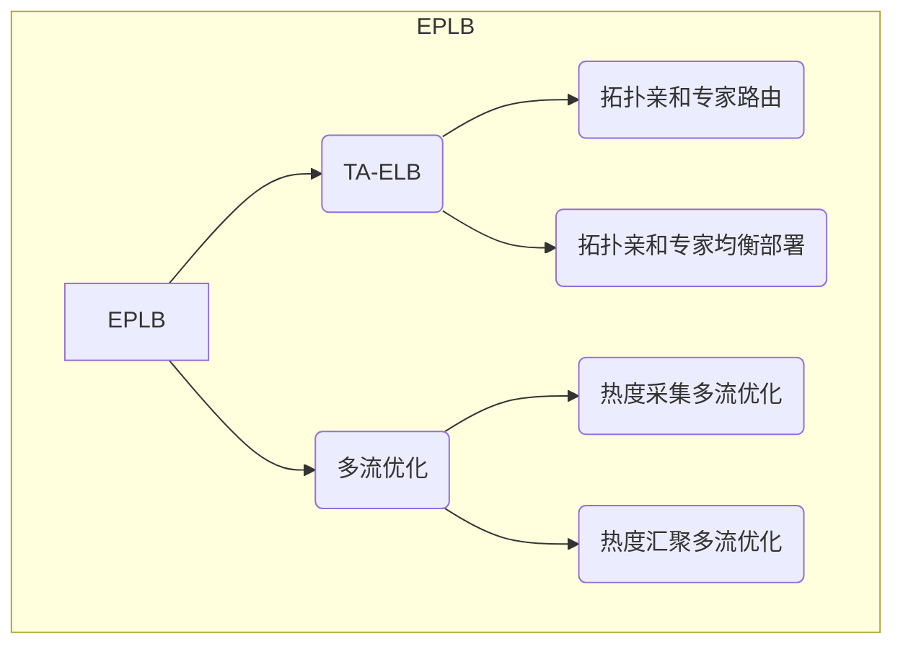
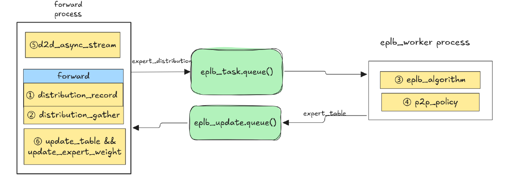

# 通用大EP EPLB特性调优

`v1.0 | 最后更新: 2025-08-04|小巧灵算力突击队`  

---

## 一、特性概述
### 1.1 特性概述
EPLB（Expert Parallelism Load Balancer）是将稀疏模型中的MoE权重在计算设备（如GPU、NPU）上重新排布的功能，其目的是平衡各个计算设备的工作负载，从而提高LLM的推理速度。

目前，vllm-ascend支持两种EPLB：
- 静态EPLB：拉起服务时传入专家部署表。

- 动态EPLB：拉起服务时专家部署表可选，后续每一定轮次根据收集到的**专家热度信息**和**专家部署表生成算法**，生成新的专家部署表，并且更新MoE权重分布。

本次性能调优包含两个技术点：
- TA-ELB（Topology-Aware Expert Load Balancing）拓扑亲和专家负载均衡。MoE模型跨机通信占比高、开销大，现有EPLB算法没有优先考虑计算设备间的通信问题和拓扑结构，导致跨机通信开销大。我们引入**拓扑亲和专家路由**和**拓扑亲和专家均衡部署**两个优化点，来解决这一问题。

- 多流优化。针对动态EPLB算法引入的热度采集和热度汇聚模块，使用**多流并发**思想进行优化，尽可能减少这部分的资源开销

### 1.2 优化场景与目标
针对qwen3-235B场景，服务化推理， 4K+1.5K,  性能持平xx; RL 场景， 2K+20K/2K+32K，性能持平xx
`待修改`

### 1.3 关键量化指标
|  **指标**  | **定义**              | **优化目标** | 测量工具         |
| :--------: | --------------------- | ------------ | ---------------- |
|   `TTFT`   | 首Token响应时间       | ≤200ms       | PyTorch Profiler |
|   `TPOT`   | 单Token生成时间       | ≤50ms/token  | vLLM Benchmark   |
| `显存占用` | KV Cache+模型权重峰值 | 降低40%+     | NVIDIA SMI       |
|  `吞吐量`  | Tokens/秒             | 提升2倍      | Locust压测工具   |

`待修改`
---

## 二、方案设计
### 2.1 方案逻辑流程


*图1：EPLB优化逻辑*

### 2.2 核心优化点
#### 2.2.1 TA-ELB
**拓扑亲和专家路由**
原始EPLB方案会根据逻辑专家-物理专家的映射表，为每个卡生成逻辑专家-物理专家的**1对1路由表**，对于存在冗余专家的逻辑专家，会随机选择一个物理专家，生成路由表。
- 优化点：为每个卡生成**1对多路由表**，按照本卡-本rank-跨rank的优先级进行路由。

**拓扑亲和专家均衡部署**
原始EPLB方案会在生成专家部署时优先关注**全局热度均衡**，从而忽略专家路由带来的开销。
- 优化点：对于有冗余副本的专家，优先将**不同副本分散到不同host**上。


### 2.2.2 多流优化
**热度采集多流优化**
由于热度采集在prefill和decode阶段均需要用到，且在decode阶段开销大，因此重点优化decode阶段的热度采集模块。热度采集与MoE的主计算流程不存在数据依赖关系，因此可以进行多流并发优化。
- 优化点：在decode阶段，模型采用torchair模式整图下发，用 torchair.scope.npu_stream_switch 这个接口进行多流并发

**热度汇聚多流优化**

由于热度汇聚仅在forword之后进行，且采用的是单算子调用模型。
- 优化点：用 torch.npu.stream 接口进行多流并发
---

## 三、工程模块设计
### 3.1 系统架构

*图2：vllm-ascend EPLB架构*
1-2. 每次执行推理中，采集热度，系统每执行 N 轮后，进行热度汇聚上报，将热度信息放入到 eplb_task 队列中。
3. eplb_worker 进程阻塞等待从 eplb_task 中获取专家热度信息，执行专家负载均衡算法，输出专家放置表。
4. 根据新旧专家表，生成专家传输 task
5. 在 forward 前，下发传输任务。
6. 在 forward 结束，等待传输任务结束，并更新该层的专家表以及专家权重。

### 3.2 关键模块
#### 模块1：TA-ELB
**拓扑亲和专家路由**
**功能**：  
为每个卡生成**1对多路由表**，按照本卡-本rank-跨rank的优先级进行路由。
涉及到3.1中⑥的部分

**接口**：
```python
"""vllm-ascend/ops/expert_load_balancer.py 新增rank_id"""
def generate_log2phy_expert_map(self, layer_id, rank_id)-> Tuple [List, int]:
    """ 返回log2phy_map，log2phy_map的最长list长度 """

"""vllm-ascend/ops/expert_load_balancer.py 新增函数，用于更新log2phy_map"""
def update_expert_map(self, expert_loc, log2phy_map, max_num_dups, rank_id):

"""vllm-ascend/quantization/w8a8_dynamic.py 新增token_selector用于选择合适的物理专家"""
def fused_experts_with_mc2(
    hidden_states: torch.Tensor,
    w1: torch.Tensor,
    w2: torch.Tensor,
    w1_scale: torch.Tensor,
    w2_scale: torch.Tensor,
    topk_weights: torch.Tensor,
    topk_ids: torch.Tensor,
    top_k: int,
    expert_map: torch.Tensor = None,
    moe_all_to_all_group_name: str = "",
    log2phy: torch.Tensor = None,
    global_redundant_expert_num: int = 0,
    shared_experts: Optional[Any] = None,
    token_selector: torch.Tensor = None,
) -> Union[torch.Tensor, Tuple[torch.Tensor, torch.Tensor]]:

"""vllm-ascend/quantization/w8a8_dynamic.py 新增token_selector用于选择合适的物理专家"""
def fused_experts_with_all2all(
    hidden_states: torch.Tensor,
    w1: torch.Tensor,
    w1_scale: torch.Tensor,
    w2: torch.Tensor,
    w2_scale: torch.Tensor,
    topk_weights: torch.Tensor,
    topk_ids: torch.Tensor,
    top_k: int,
    expert_map: torch.Tensor = None,
    ep_group: GroupCoordinator = None,
    log2phy: torch.Tensor = None,
    global_redundant_expert_num: int = 0,
    token_selector: torch.Tensor = None,
)-> Union[torch.Tensor, Tuple[torch.Tensor, torch.Tensor]]:
```

**拓扑亲和专家均衡部署**
**功能**：  
对于有冗余副本的专家，优先将**不同副本分散到不同host**上。
涉及到3.1中③的部分

**接口**：
```python
"""vllm_ascend\eplb\core\policy\dynamic_ep.py 新增一个card_per_host变量，表示每个host上的die/卡数"""
def original_compute_balanced_pack_redundancy(
  origin_weights, 
  card_num, 
  num_redundancy_expert, 
  card_per_host=16)-> Tuple [List, List]:
    """返回生成的新部署表"""
```
#### 模块2：多流优化
无接口修改，关注代码逻辑
涉及到3.1中①②的部分

**热度采集优化**
```python
"""vllm_ascend\ops\fused_moe.py"""
if self.dynamic_eplb:
    # prefill阶段，不进行多流并发
    if is_prefill:
        token_nums = expert_token_num if group_list_type else \
            torch.cat([expert_token_num[:1], expert_token_num[1:] - expert_token_num[:-1]])
        self.moe_load.add_(token_nums)
    else:
        # decode阶段，使用包装的npu_stream_switch进行多流并发
        with npu_stream_switch("moe_load_async", 0):
            # 热度汇聚依赖 expert_token_num 结果，需要等待
            npu_wait_tensor(hidden_states, expert_token_num)
            token_nums = expert_token_num if group_list_type else \
                torch.cat([expert_token_num[:1], expert_token_num[1:] - expert_token_num[:-1]])
            self.moe_load.add_(token_nums)
```

**热度汇聚优化**
```python
"""vllm_ascend\eplb\eplb_updator.py"""
if dist.is_initialized():
    # 热度汇聚使用单算子调用模式，因此使用torch.npu.stream进行多流并发
    with torch.npu.stream(self.compute_moe_load_async):
        self.world_size = dist.get_world_size()
        self.device = local_load.device
        if self._gather_buffer is None:
            shape = (self.world_size, *local_load.shape)
            self._gather_buffer = torch.empty(shape,
                                            dtype=local_load.dtype,
                                            device=self.device)

        dist.all_gather_into_tensor(self._gather_buffer, local_load)

        moe_load = self._gather_buffer.permute(1, 0, 2)
        self.shared_dict["moe_load"] = moe_load.cpu()
        logger.debug(f"[ModelRunner] Updated shared_dict['moe_load'] shape={moe_load.shape}")
```


---

## 四、测试方案
### 4.1 测试策略说明
| **测试类型** | 工具                                 | 验证指标      | 通过标准        |
| ------------ | ------------------------------------ | ------------- | --------------- |
| 吞吐测试 | `vllm/benchmarks/benchmark_serving.py` | TPOT | TPOT减少xx     |

### 4.2 测试数据集与测试结果
#### 4.2.1 TA-ELB数据
****
测试环境：
- A3 4机 PD混部
- 数据集：xxx 

图（待填）

- 注：
basic			基线，不开启eplb，也不传入expert_map
eplb0-64		0冗余专家，64die
eplb64-64		64冗余专家，64die
eplb-without 	没有开启prefill阶段热度采集，其余开启prefill阶段热度采集功能。开启该功能可能影响性能  

#### 4.2.2 多流优化 
待补充


## 五、附录
### 关联PR
| PR链接 | 日期       | 修改内容 | 提交人   |
| ---- | ---------- | -------- | -------- |
|https://github.com/Skywalker-EP/vllm-ascend/commit/b3a1718bed22eefe9941b1a0ea16f75b4f2c08a2 | 2025-07-25 |  TA-ELB 拓扑亲和专家均衡部署  | 徐天宇 00882759  |
|https://github.com/Skywalker-EP/vllm-ascend/commit/55dfc7ca330516546f19ad544709790af496ab83 | 2025-07-29 |  TA-ELB 拓扑亲和专家路由  | 杨诚 00806874  |
|https://github.com/Skywalker-EP/vllm-ascend/commit/494cbb83edd9111357b05c7adeec0680d1012d4e | 2025-07-31 |  多流优化  | 陈浩 00562869  |

### 参考文档
1.  